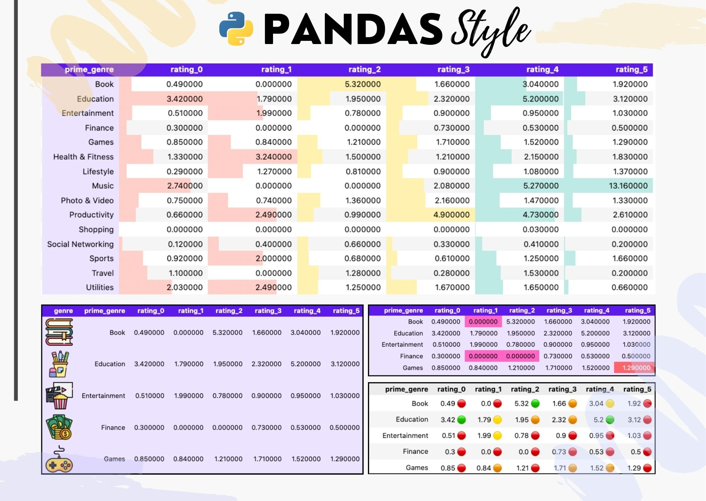

#  Transform your Pandas Dataframes: Styles, 🎨 Colors, and 😎 Emojis

In the following section of this article, we will explore a method to add colors and styles to Pandas DataFrames. Our focus will be on the application of colors and emojis, utilizing approaches similar to the popular conditional formatting commonly employed in pivot tables within spreadsheets. Through this strategy, we aim to enhance the presentation of our data, making the exploration and understanding of information not only informative but also visually appealing

---

image generated using [partyrock](https://partyrock.aws/)

----

# What is Pandas Style?
**Pandas Styler** is a great feature that allows to customize the appearance of DataFrames during visualization. This functionality grants users the ability to highlight, color, and format cells based on specific conditions, facilitating the visual identification of patterns and trends in the data. 
Therefore, Pandas Styler provides an intuitive and flexible interface for applying conditional styles, allowing users to enhance the readability of DataFrames and effectively emphasize key information. This capability not only elevates the visual appeal of the data but also contributes to a clearer and more comprehensible analysis of datasets.

---

----

In this repository you can find a `pandas_style` python notebook and it has the code with you are going to create a pivot table using a set of data and from this you will begin to give it different styles and conditional formats such as can be seen in the previous image.

---

